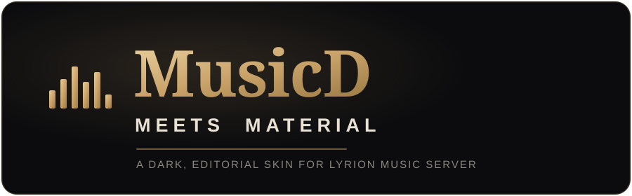

  

  A dark, editorial reskin of <a href="https://github.com/CDrummond/lms-material">LMS&nbsp;Material</a> for the Lyrion Music Server &mdash; brass on near-black, built for late-night listening.

<b>Version 1.0.0</b>

-----

## What it is

**MusicD meets Material** is a visual fork of the Material skin for [Lyrion Music Server](https://lyrion.org) (formerly Logitech Media Server). It keeps everything that makes Material great and dresses it in a calmer, more editorial look: a warm brass accent, near-black surfaces, and a serif/sans type pairing (Fraunces + Manrope).

Crucially, it is a **re-base onto stock Material**, keeping the original `Plugins::MaterialSkin` Perl namespace intact. That means third-party home-screen integrations — Qobuz scrollable lists, BBC, Bandcamp and the like — keep working exactly as they do on stock Material. Only the look changes.

## Highlights

- **Brass-on-black theme** — a single warm accent (`#c9a36a`) across the whole UI: buttons, sliders, the now-playing seek bar, and progress indicators.
- **Editorial typography** — Fraunces for titles, Manrope for everything else.
- **3-column album grid** on phones for a denser, gallery-like browse.
- **Reworked Now Playing** — quieter transport, brass play control, a calmer seek bar.
- **Richer share card** — cover art alongside the album title, artist, and (when available) an album review. No-review placeholders are suppressed so cards stay clean.
- **Themed classic settings pages** to match, where reachable.
- **Drop-in** — no extra dependencies; it replaces the Material skin.

## Requirements

- Lyrion Music Server (Material-compatible release).
- Re-based on Material **6.4.2**.

## Installation

This skin installs **as Material** — it replaces the stock Material skin rather than living alongside it.

1. Download the latest `MusicD-meets-Material-vX.Y.Z.zip`.
1. Extract it. Inside is a folder named **`MaterialSkin`** — this name must not change (the Perl namespace maps to the folder).
1. Copy that `MaterialSkin` folder into your LMS **Plugins** directory, replacing the existing one.
1. Restart Lyrion Music Server.
1. Clear your browser / app website data once (iOS PWAs aggressively cache the bootstrap page).

> **Note:** because it installs as Material, don’t also install stock Material from the plugin repo — they collide. The build uses a custom plugin ID so the repo won’t silently auto-update over it.

## Updating

Repeat the install steps with the newer zip, then clear website data so the new assets load.

## Versioning

Semantic versioning, where this skin’s version is independent of the underlying Material base:

|Change          |Bump |Example          |
|----------------|-----|-----------------|
|Touch-up / patch|patch|`1.0.0` → `1.0.1`|
|New feature     |minor|`1.0.x` → `1.1.0`|
|Major overhaul  |major|`1.x.x` → `2.0.0`|

## Built on

Based on the excellent [**LMS-Material**](https://github.com/CDrummond/lms-material) by Craig Drummond (MIT License). All credit for the underlying skin and its functionality goes to that project; MusicD meets Material is purely a visual layer on top.

## License

Inherits the MIT License of LMS-Material. The MusicD visual layer (theme, logo, type, share-card styling) is provided under the same terms.

-----

<i>MusicD meets Material &mdash; made for the music.</i>
